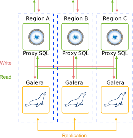
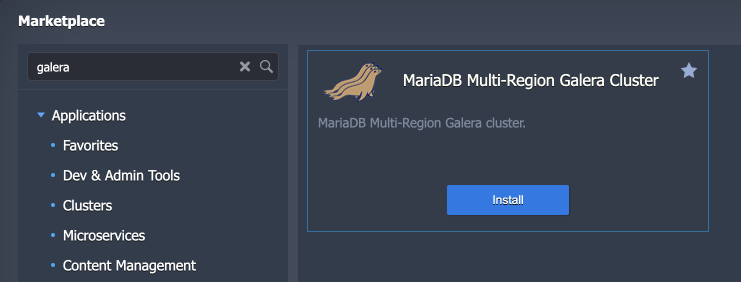
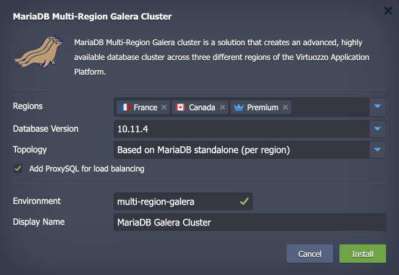
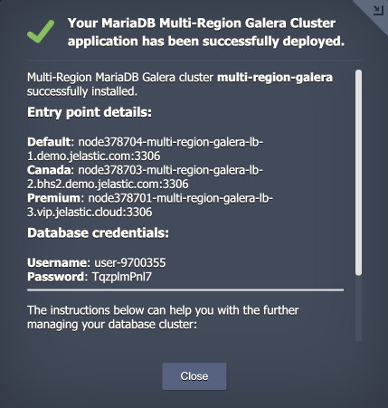

<p align="center">

</p>

## MariaDB Multi-Region Galera Cluster

MariaDB Multi-Region Galera cluster is a solution that creates an advanced, highly available cluster across several regions of the Virtuozzo Application Platform. The solution implements so-called certification-based replication. The basic idea is that the transaction to be replicated - the write set - not only contains the database rows to copy but also includes information about all the locks held by the database (i.e., InnoDB) during the transaction. Each node then certifies the replicated write set against other write sets in the applier queue, and if there are no conflicting locks, we know that the write set can be applied. At this point, the transaction is considered committed, after which each node continues to apply it to the InnoDB tablespace.


## Database Topology

The Multi-Region Galera Cluster consists of node groups deployed into three different regions. Depending on the required level of performance and high availability, you can choose between two topology options:

- **Based on MariaDB standalone (per region)** – provides a single MariaDB instance in each of the three regions that form the Galera cluster

<p align="left">

</p>

- **Based on MariaDB Galera cluster (per region)** – creates Galera cluster (3 nodes) in each region (9 nodes total)

<p align="left">

</p>

Both topologies provide out-of-box high availability and failover capabilities for your database cluster. In case of a cluster node failure, both topologies ensure that the database cluster works without downtime.

Additionally, the package provides a setting to include/exclude highly available [ProxySQL Load Balancer](https://www.proxysql.com/) layer in front of the cluster, which will distribute requests between nodes.


## High Availability and Failover

The main purpose of Cross-Region DB clusters is high availability and failover capabilities. For Galera, if one node in the cluster fails, the other nodes continue to operate as usual. When the failed node comes back online, it automatically synchronizes with the other nodes before it is allowed back into the cluster. The same approach is applied for the single region failure, so *<u>no data is lost in single node/region failures</u>*.


## Installation Process

1\. Go to the Virtuozzo Application Platform [Marketplace](https://www.virtuozzo.com/application-platform-docs/marketplace/), find the ***MariaDB Multi-Region Galera Cluster*** application, and **Install** it.



2\. Provide the following details in the opened installation window:

- **Regions** – choose three regions on the platform from the drop-down list
- **Database Version** – select the preferred tag version for the MariaDB stacks used for the Galera cluster
- **Topology** – choose between the *standalone* and *Galera cluster* options per region
- **Add ProxySQL for load balancing** – tick to add ProxySQL in front of your cluster (as a separate environment in each region)
- **Environment** – provide a name that will be used for environments’ naming and multi-region environments isolation (i.e., [environment group](https://www.virtuozzo.com/application-platform-docs/environment-groups/) name)
- **Display Name** – custom [alias](https://www.virtuozzo.com/application-platform-docs/environment-aliases/) for the environments



3\. Click **Install** and wait for the installation success notification with entry point details and access credentials.



Additionally, you’ll receive an email with the same information.


## Entry Point

The multi-regional Galera cluster can be accessed from each region. The required entry point can be comprised of the preferred region name and ProxySQL node (if added) or SQL layer:

- with ProxySQL

```
node${ID}-${envName}-lb-{1|2|3}.${domain}:3306
```

- without ProxySQL

```
sqldb.${envName}-db-{1|2|3}.${domain}:3306
```

You can view the exact entry points for your multi-regional Galera cluster in the after-installation success window and email.